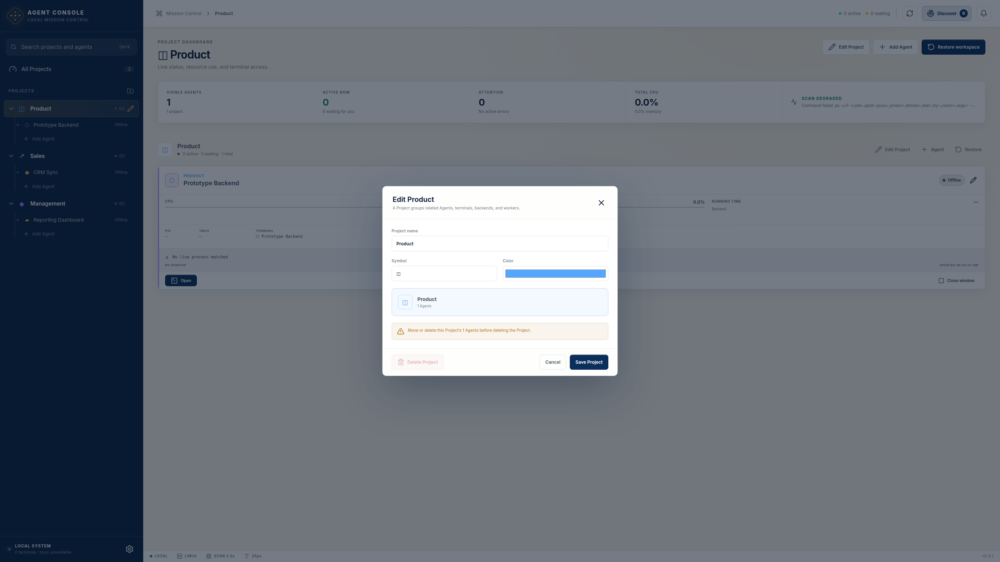

# Agent Console

Agent Console 是运行在 Linux Mint 上的本地 AI Team 控制中心。它不把几十个终端塞进一个窗口，而是先回答 CEO 真正关心的问题：哪些 Project 正在运行、哪些 Agent 在思考、哪些在等人、哪里出错了，以及双击后怎样立即回到正确的终端。



## 当前版本已经实现

- Settings 内置应用更新中心：自动或手动检查新版，显示更新说明与下载进度，下载完成后可直接重启并安装。
- AppImage 与 deb 都支持应用内更新；AppImage 直接自我替换，deb 安装时由 Linux 弹出系统授权窗口。
- 每次新版本标签都会触发 GitHub 自动测试、打包并发布 AppImage、deb 与更新元数据。
- 默认采用象牙白、海军蓝、金色的明亮高对比主题。
- Settings 可将整个界面字号从 5 px 调到 50 px；默认 25 px，调节时实时预览并自动保存。
- 高分屏缩放由 Electron 原生处理，避免整页 CSS 缩放造成浮层与鼠标命中位置短暂错位。
- 内置 16 套完整主题，包括中国青花、日本和纸、包豪斯、瑞士现代、装饰艺术、北欧峡湾、地中海、撒哈拉、波斯夜色、Solarpunk 与 Cyber Tokyo 等方向。
- 高密度的 Project Explorer；Project 可折叠，Agent 可拖动排序或移动到其他 Project。
- Project 编辑入口始终可达：选中后左侧显示铅笔按钮，Dashboard 顶部和每个 Project 区块都有 **Edit Project**，也可双击 Project 名称编辑。
- Project/Agent/Settings 编辑期间会暂存最新一次后台扫描，关闭编辑器后再刷新 Dashboard；编辑表单不会被实时扫描打断。
- 删除 Agent 或空 Project 时使用应用内二段式确认，不再调用会导致 Linux/Electron 焦点异常的系统确认框。
- 配置保存严格排队并采用原子写入；主文件损坏时优先恢复最近一次有效备份，并保留损坏文件供排查。
- 首页显示全部 Project 和 Agent，不默认显示终端。
- Agent 卡片显示名称、所属 Project、Terminal Title、tmux Session、PID、工作目录、CPU、Memory、运行时间、状态、更新时间和最后一句输出。
- 自动发现当前用户的 Codex、tmux、Terminal、Python、Node、Backend、Worker 和 Docker 容器。
- 把发现的进程加入 Project，并可人工改名、设置 Emoji 和颜色。
- 双击 Agent：优先聚焦已有终端；仅在没有对应窗口或进程时新建。
- 支持 GNOME Terminal、Kitty、Ghostty、Konsole、XFCE Terminal 和系统默认终端。
- 使用 tmux 时，关闭终端窗口不会停止 Agent；再次双击会重新连接同一个 Session。
- Restore workspace 可恢复 Project 中配置为自动启动的 Agent。
- 所有 Project 与 Agent 配置保存在本机，不上传服务器。

## 最省心的安装方法（Linux Mint）

### 第一步：打开这个文件夹

在 Linux Mint 的文件管理器中进入 `agent-console` 文件夹，在空白处右键，选择“在终端中打开”。

### 第二步：检查电脑环境

在终端中复制并执行：

```bash
./scripts/check-system.sh
```

如果它提示缺少 `tmux`、`wmctrl` 或 GNOME Terminal，再执行：

```bash
sudo apt update
sudo apt install -y tmux wmctrl gnome-terminal
```

其中：

- `tmux` 让 Agent 在终端窗口关闭后继续工作。
- `wmctrl` 让 Agent Console 找到、聚焦和关闭已有终端窗口。
- GNOME Terminal 是 Linux Mint 上最省心的外部终端选择；如果你已经使用 Kitty 或 Ghostty，也可以不装它。

### 第三步：第一次运行

依次执行：

```bash
npm install
npm run dev
```

稍等片刻，Agent Console 桌面窗口会自动打开。

### 第四步：制作可以双击安装的版本

确认程序运行正常后，执行：

```bash
./scripts/build-linux.sh
```

完成后，安装包在 `release` 文件夹中：

- `.AppImage`：不需要安装，赋予执行权限后即可双击运行。
- `.deb`：像普通 Linux 安装包一样双击安装。

## 第一次使用

1. 点击左下角齿轮进入 **Settings**，先把字号和主题调到舒服的状态。
2. 点击右上角 **Discover**。
3. 找到正在运行的 Codex、Backend 或 Worker。
4. 点击 **Add to Project**，选择 Project 并保存。
5. 回到 Dashboard，双击 Agent 卡片即可进入对应终端。

要修改 Project 名称、图标或颜色，可点击 Project 页面右上角的 **Edit Project**。左侧当前 Project 旁边也会常驻一个金色铅笔按钮。

要建立一个以后可以自动恢复的 Codex Agent：

1. 在目标 Project 中点击 **Add Agent**。
2. 填写名称和工作目录。
3. 填写一个唯一的 tmux Session，例如 `product-roadmap-codex`。
4. Launch command 填写 `codex`。
5. 勾选 **Include in workspace restore**。
6. 保存后点击 Project 右侧的 **Restore**。

## 以后怎样更新

v0.3.0 是加入应用内更新功能的第一个版本，因此从 v0.2.2 升到 v0.3.0 仍需最后手动安装一次。

从 v0.3.0 开始：

1. Agent Console 启动约 15 秒后会自动检查一次更新，之后每 6 小时检查一次。
2. 有新版时，右上角更新按钮和底部版本号会出现提示。
3. 点击左下角齿轮进入 **Settings → Application updates**。
4. 点击 **Download update**，可以看到百分比、速度和文件大小。
5. 下载完成后点击 **Restart and update**。
6. AppImage 会自动替换并重新打开；deb 可能弹出 Linux 系统密码窗口，确认后即可完成。

更新只替换应用程序，不会删除 `~/.config/agent-console/mission-control-state.json`，因此 Project、Agent、字号和主题都会保留。每次成功保存还会维护一个 `mission-control-state.json.bak` 作为最近有效备份。

## 状态是怎样判断的

| 状态 | 含义 |
| --- | --- |
| Running | 程序正在运行或持续提供服务 |
| Thinking | Codex 最近有活动，或输出中显示正在分析、搜索、生成 |
| Waiting | 输出显示正在等待用户输入、确认或审批 |
| Idle | 进程存在，但当前活动很低 |
| Finished | 最后一段输出明确显示任务完成 |
| Error | 进程异常，或最后输出包含明确的 fatal / panic / traceback |
| Offline | 没有找到与该 Agent 匹配的进程 |

tmux Agent 的最后输出可直接读取。其他程序若要显示准确的最后一句输出，可在 Agent 编辑窗口中填写 Log file。

## “不会重复打开终端”的边界

Agent Console 通过唯一 Terminal Title 和 `wmctrl` 查找窗口；发现窗口后只聚焦，不会再次创建。对于正在运行但无法定位窗口的 PID，它会停止操作并提示，而不会贸然重复启动一份进程。

为了获得最稳定的体验，建议长期运行的 Agent 都使用 tmux，并确保系统安装了 `wmctrl`。

## 当前明确不做的事情

第一版刻意不包含：聊天、内嵌终端、远程主机、AI 自动编排、任务调度和 Agent 间通信。Agent Console 只负责管理、显示和切换。

## 开发命令

```bash
npm run typecheck       # TypeScript 检查
npm test                # 自动测试
npm run build           # 生产构建
npm run test:project-edit-visual # 真实删除 Agent 后立即编辑 Project，并跨扫描/缩放反复输入的回归检查
npm run dev             # 开发运行
npm run package:linux   # 生成 AppImage 与 deb
npm run release:linux   # 测试、构建并发布 GitHub Release（仅发布流程使用）
```

主要结构：

```text
electron/               Electron 主进程、本机扫描、终端控制、应用更新
shared/                 主进程与界面共用的数据类型
src/                    React Dashboard
tests/                  状态判断、进程解析、配置修复测试
resources/              应用图标
```

## 本机数据与安全

- Electron 界面启用 `contextIsolation`，不直接获得 Node.js 或系统命令权限。
- 界面只能调用预先定义的操作：读取状态、保存配置、刷新、打开/聚焦/关闭终端、恢复 Project，以及检查、下载和安装受信任的正式更新。
- 应用启动后约 15 秒检查 GitHub Releases，之后每 6 小时检查一次；只读取版本与安装包信息，不上传 Project 或 Agent 数据。
- 更新包通过 HTTPS 下载，并按发布元数据中的 SHA-512 检查下载完整性；检查通过后才会出现安装按钮。
- 配置通常保存在 `~/.config/agent-console/mission-control-state.json`。
- “Close window”只关闭终端窗口；使用 tmux 时不会停止里面的任务。
